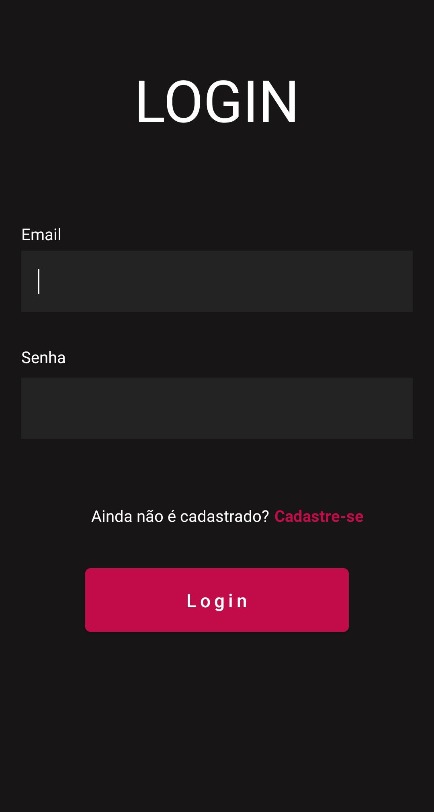
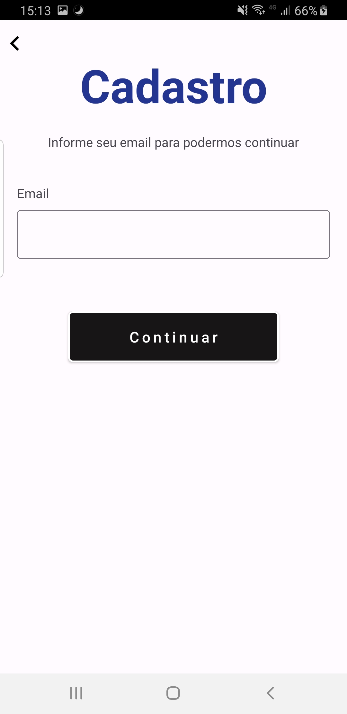
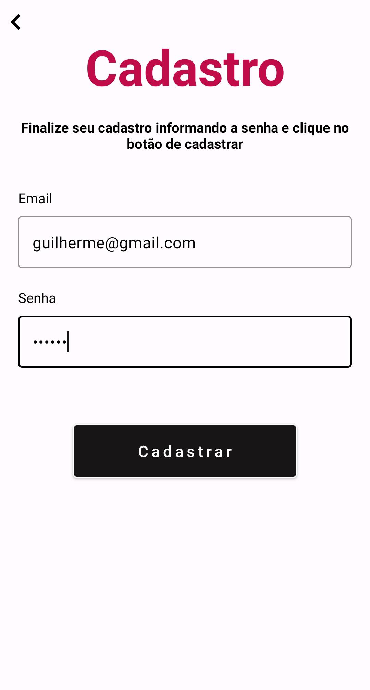
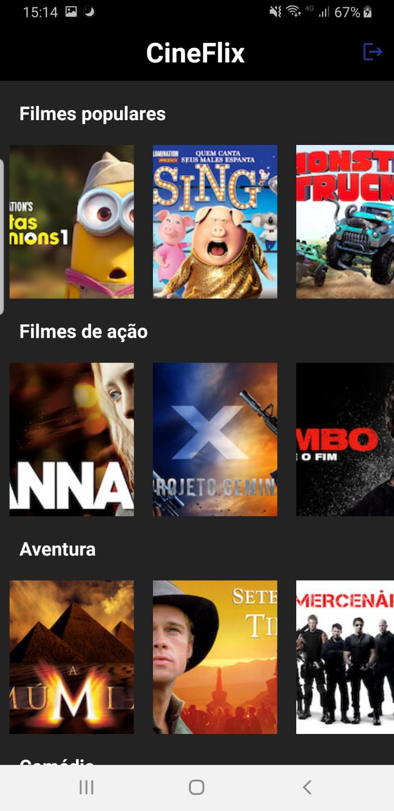
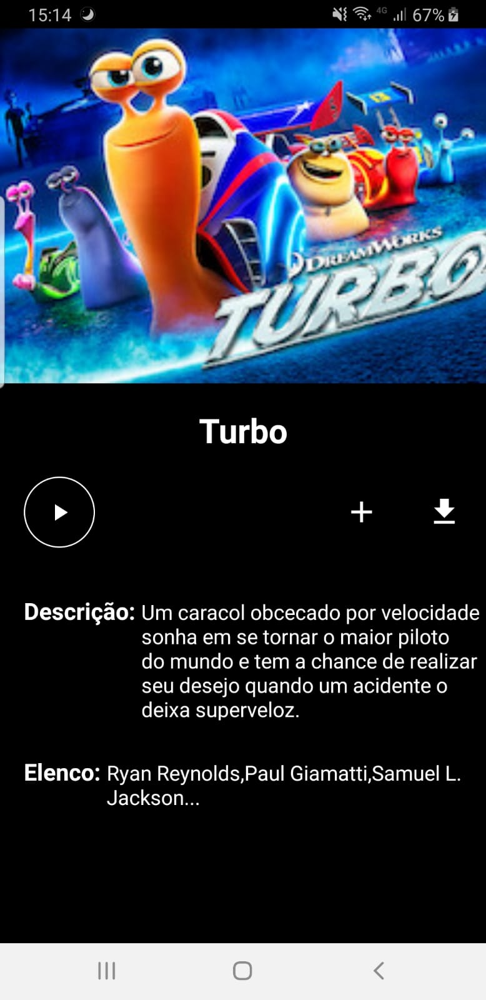
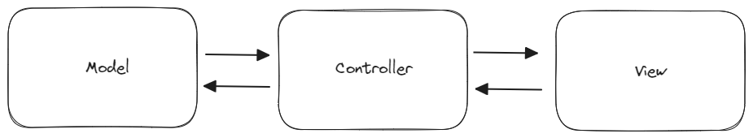
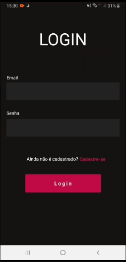

<h1 align="center">CINEFLIX</h1>

  <p align="center">
  <a href="https://opensource.org/licenses/Apache-2.0"></a>
  <a href="https://android-arsenal.com/api?level=24"></a>
  <br>
  <a href="https://wa.me/+5527998754853"></a>
  <a href="https://www.linkedin.com/in/guilherme-martins-032861251/"></a>
  <a href="mailto:guihroch@gmail.com"></a>
</p>

<p align="center">  

⭐ Esse é um projeto para demonstrar meu conhecimento técnico no desenvolvimento Android nativo com Kotlin. Mais informações técnicas abaixo.

🎥 Aplicativo com diversas opções e categorias diferentes de filmes, possuindo tela de detalhes, cadastro e autenticação de usuário.


</p>

</br>

<p float="left" align="center">


  
  
  
  
   
  
</p>

## Download
BADGE DA PLAYSTORE https://play.google.com/intl/en_us/badges/

Ou faça o download da <a href="apk/app-debug.apk?raw=true">APK diretamente</a>. Você pode ver <a href="https://www.google.com/search?q=como+instalar+um+apk+no+android">aqui</a> como instalar uma APK no seu aparelho android.

## Tecnologias usadas e bibliotecas de código aberto

- Minimum SDK level: 24
- [Linguagem Kotlin](https://kotlinlang.org/).

- Jetpack 
  - Lifecycle: Observe os ciclos de vida do Android e manipule os estados da interface do usuário após as alterações do ciclo de vida.
  - RecyclerView: Permite a criação de listas dinâmicas através do reaproveitamento de itens presentes na mesma, melhorando o desempenho do app.
  - ViewBinding: Liga os componentes do XML no Kotlin através de uma classe que garante segurança de tipo e outras vantagens.
  - Custom Views: View customizadas feitas do zero usando XML.
  - Material Design Components: Permite a criação de uma interface de usuário utilizando diversos componentes interativos e personalizáveis.
  - ConstraintLayout: Permite a criação de layouts complexos sem a necessidade de uma hierarquia de visualização aninhada.
  
- Bibliotecas
  - [Retrofit2](https://github.com/square/retrofit): Para realizar requisições seguindo o padrão HTTP.
  - [Glide](https://github.com/bumptech/glide): Para carregamento de imagens e cacheamento das mesmas.
  - [Firebase Authentication](https://firebase.google.com/docs/auth?hl=pt): O Firebase Authentication é um serviço de back-end projetado para simplificar o processo de autenticação de usuários.
  

## Arquitetura

**CINEFLIX** utiliza a arquitetura MVC (Model - View - Controller) que é um padrão de projeto de software que separa a interface do usuário (View) e das regras de negócio e dados (Model) usando um mediador (Controller) para conectar o modelo à view. 
</br></br>

<br>

## API de terceiros

CineFlix utiliza a API de filmes [https://stackmobile.com.br/filmes] disponibilizada pelo professor Marcos Duarte no curso Stack Mobile de desenvolvimento android.

## Features

### Tela de Login


Onde irá ocorrer a autenticação do usuário já cadastrado através do Firebase authentication, caso o usuário digite um email ou uma senha inválida, ele será notificado. Caso haja sucesso na autenticação, o usuário será encaminhado para a pagina principal do CineFlix.

### Feature 2


Pagina Principal e de detalhes do filme.

### Feature 3


Tela de Cadastro.

# Licença

COLOQUE A LICENÇA - https://opensource.org/licenses

```xml

```
